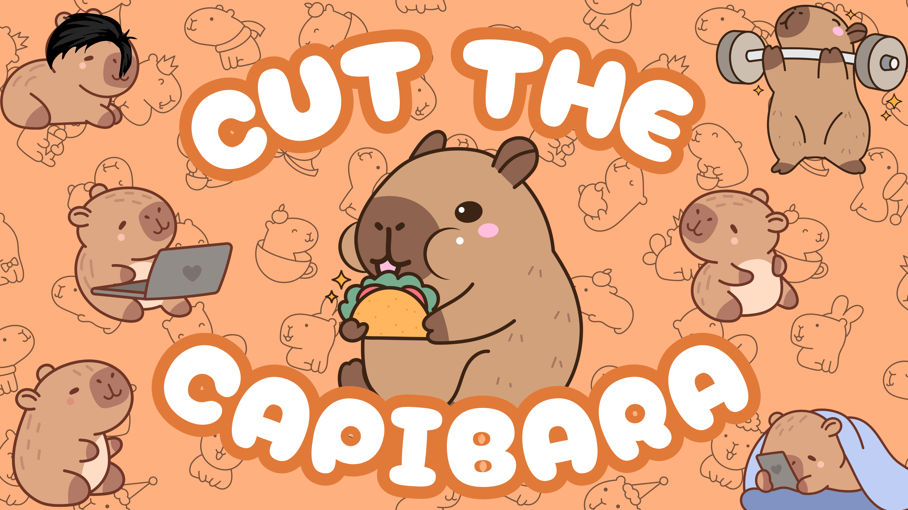
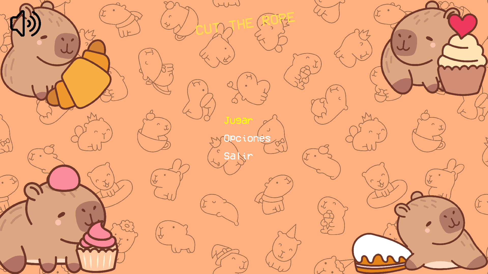
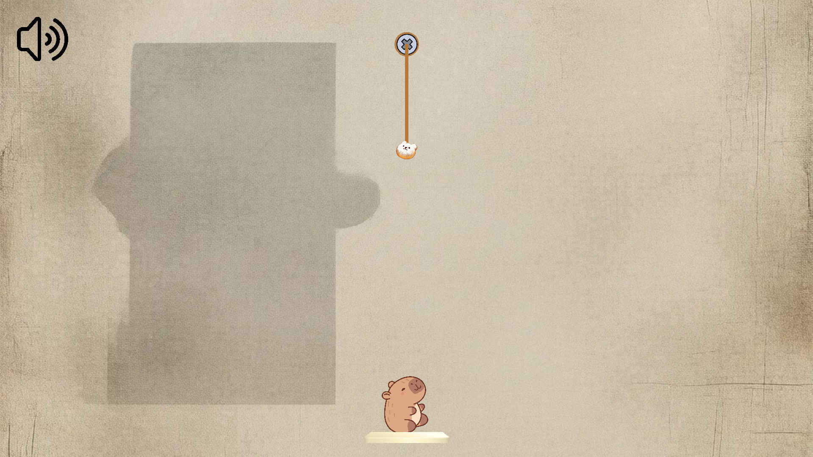
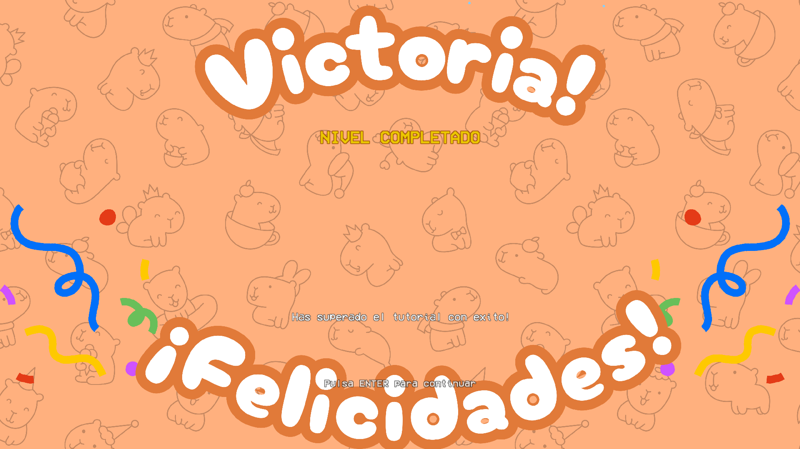

# Cut the Capibara



## Descripción

**Cut the Capibara** es un juego de puzles basado en física inspirado en el popular "Cut the Rope", desarrollado en C++ utilizando la biblioteca SFML. El objetivo del juego es alimentar a un adorable capibara cortando estratégicamente cuerdas para guiar un dulce hasta su boca mientras enfrentas diversos desafíos.

## Características Principales

- **Física realista**: Sistema de cuerdas con comportamiento físico basado en el algoritmo de Verlet
- **Controles intuitivos**: Corta cuerdas con un simple clic del ratón
- **Desafíos progresivos**: Comienza con un tutorial sencillo y avanza hacia retos más complejos
- **Efectos visuales atractivos**: Animaciones fluidas y efectos visuales para una experiencia inmersiva
- **Banda sonora original**: Música ambiental que complementa perfectamente la experiencia de juego

## Requisitos del Sistema

- Sistema Operativo: Windows 7/8/10/11 (64 bits)
- Procesador: Intel Core i3 o equivalente
- Memoria RAM: 2 GB mínimo
- Tarjeta gráfica: Compatible con DirectX 9
- Espacio en disco: 100 MB
- Dependencias: Runtime de SFML 2.5.1 o superior

## Instalación

### Para Usuarios
1. Descarga la última versión desde [la página de releases](https://github.com/tu-usuario/cut-the-capibara/releases)
2. Descomprime el archivo ZIP en la ubicación que prefieras
3. Ejecuta `game.exe` para iniciar el juego

### Para Desarrolladores
1. Clona este repositorio:
```bash
git clone https://github.com/tu-usuario/cut-the-capibara.git
```

2. Asegúrate de tener instalado MSYS2 con MinGW-w64 y SFML:
```bash
# En la consola de MSYS2
pacman -S mingw-w64-x86_64-gcc mingw-w64-x86_64-sfml
```

3. Compila el proyecto:
```bash
cd cut-the-capibara
mingw32-make
```

4. Ejecuta el juego:
```bash
bin/game.exe
```

## Controles

- **Ratón**: 
  - Clic izquierdo: Cortar cuerdas
- **Teclado**:
  - W/S o Flechas arriba/abajo: Navegar por menús
  - Enter: Seleccionar opción
  - Escape: Volver/Pausar
  - M: Activar/desactivar música

## Estructura del Proyecto

```
Proyecto3P/
│
├── assets/              # Recursos del juego
│   ├── fonts/           # Fuentes tipográficas
│   ├── images/          # Imágenes y sprites
│   └── sound/           # Música y efectos sonoros
│
├── bin/                 # Archivos ejecutables compilados
│
├── docs/                # Documentación
│   ├── Manual_Usuario.md      # Manual del usuario
│   ├── Manual_Programador.md  # Manual del programador
│   └── diagrama_clases.puml   # Diagrama UML de la arquitectura
│
├── include/             # Archivos de cabecera (.hpp)
│
├── src/                 # Código fuente (.cpp)
│
└── Makefile             # Script de compilación
```

## Documentación

- [Manual del Usuario](./docs/Manual_Usuario.md) - Guía completa para jugadores
- [Manual del Programador](./docs/Manual_Programador.md) - Documentación técnica del proyecto
- [Diagrama de Clases](./docs/diagrama_clases.puml) - Representación visual de la arquitectura

## Desarrollo

### Compilación
El proyecto utiliza un Makefile para simplificar la compilación:

```bash
# Compilar el proyecto
mingw32-make

# Compilar y ejecutar
mingw32-make run

# Limpiar archivos compilados
mingw32-make clean
```

### Tecnologías utilizadas

- **Lenguaje**: C++17
- **Gráficos**: SFML 2.5.1
- **Compilador**: MinGW-w64 GCC
- **Construcción**: Make
- **Documentación**: Markdown, PlantUML

## Capturas de pantalla





## Colaboradores

- [EberOmarGarzaFuentes] - Desarrollo principal
- [FatimaGetsemaniLopezPlascencia] - Diseño de niveles/Diseño gráfico

## Licencia

© 2025 [Inei-Zone] - Todos los derechos reservados

---

## Agradecimientos

- A la biblioteca SFML y sus desarrolladores
- A todos los beta testers que ayudaron a mejorar el juego
- A la universidad y profesores que guiaron este proyecto

---

> "Cut the Capibara no es solo un juego, es una aventura lógica y física que desafía tu mente mientras te diviertes"
